# crawl

Claude Code 안에 파일 탐색창을 띄우고, 그 아래에서 **crawl**이라는 작은 빨간 캐릭터가 돌아다니는 mod입니다. 플러그인 이름은 `omok-explorer`입니다.

## 기능

### 탐색창
- 현재 프로젝트의 폴더와 파일을 트리로 보여 줍니다.
- 폴더를 누르면 펼치거나 접고, 파일을 누르면 프롬프트에 `@경로 `가 입력됩니다.
- 위쪽 버튼: `↻` 새로고침, `−` `+` 창 폭 조절(28~80칸, 6칸씩, 기본 36), `▲` `▼` 목록 스크롤.
- `.git`, `__pycache__`, `node_modules`, `.omc`는 목록에서 숨깁니다.
- `/explorer` 명령으로 창을 다시 열 수 있습니다.

### crawl
탐색창 아래쪽에 있는 12×9 픽셀 아트 캐릭터입니다. 반블록 문자로 그려서 터미널 가로 12칸, 세로 5줄을 차지합니다.

crawl은 Claude가 지금 하는 일에 맞춰 동작을 바꿉니다. 아래 이미지는 실제 터미널에서 mod를 띄워 동작마다 8프레임씩 캡처한 것입니다.

| 동작 | 언제 | 모습 |
|---|---|---|
| 생각 `think` | 요청을 받고 답을 고민할 때, 도구 사용 사이 |  <br> 위를 보다 좌우를 살피고, 말풍선에 `...`이 차오릅니다. |
| 읽기 `read` | `Read`, `Grep`, `Glob`으로 파일을 볼 때 |  <br> 가는 쪽을 보며 한 칸씩 쉬지 않고 걷습니다. |
| 편집 `edit` | `Edit`, `Write`로 파일을 고칠 때 |  <br> 다리를 번갈아 들며 방방 뛰고, `*`가 튑니다. |
| 실행 `run` | `Bash`로 명령을 돌릴 때 |  <br> 깡충깡충 세 칸씩 달립니다. |
| 검색 `web` | `WebFetch`, `WebSearch`, MCP 도구를 쓸 때 |  <br> 먼 곳을 올려다보며 까치발을 들고, `?`를 띄웁니다. |
| 위임 `agent` | 서브에이전트(`Agent`)를 부를 때 |  <br> 좌우로 몸을 흔들며 `+`로 친구를 부릅니다. |
| 실패 `error` | 도구가 오류를 내거나 턴이 오류로 끝날 때 |  <br> `×` 눈으로 부르르 떨고 `!`를 띄웁니다. 4초 동안 보이고, 그 사이 다음 도구가 시작되면 바로 그 동작으로 바뀝니다. |
| 완료 `done` | 답을 마쳤을 때 |  <br> `^` 눈으로 뛰어오르며 `♪`를 띄웁니다. 3.5초 뒤 쉬기로 돌아갑니다. |
| 쉬기 `rest` | 아무 일도 없을 때 |  <br> 탐색창 폭 안에서 랜덤하게 걷거나 서 있고, 가끔 눈을 감습니다. |

- 걷는 방향, 멈추는 시점, 방향 전환은 매번 랜덤입니다. 가장자리에 닿으면 돌아섭니다. 창 폭을 바꾸면 움직일 수 있는 범위도 같이 바뀝니다.
- 실패 동작이 보이는 중에 답이 끝나면 완료 동작이 실패를 덮지 않고, 실패를 끝까지 보여 준 뒤 쉬기로 돌아갑니다.
- 도구를 여러 개 동시에 쓰면 가장 최근에 시작하거나 끝난 도구를 따릅니다.

`/crawl <동작>`으로 crawl을 한 동작에 고정해 미리 볼 수 있습니다(`/crawl run`, `/crawl done` 등). `/crawl auto`를 입력하면 다시 Claude를 따라갑니다.

<details>
<summary>탐색창 전체 화면</summary>



</details>

## 설치

저장소를 내려받은 뒤 mod 폴더를 지정해서 Claude Code를 실행합니다.

```bash
git clone https://github.com/ksthink/cladue_mod_crawl
claude --plugin-dir ./cladue_mod_crawl
```

실행하면 세션이 시작될 때 탐색창이 열립니다. 창이 보이는 폭은 터미널 크기에 따라 달라지므로 좁으면 열리지 않을 수 있습니다. 그때는 `/explorer`를 입력하세요.

## 구성

```
.claude-plugin/plugin.json   플러그인 정보
hooks/hooks.json             로드할 모듈 목록
hooks/register.tsx           탐색창, 명령, Claude 작업에 따른 동작 전환
hooks/crawl.ts               crawl의 픽셀 아트, 동작별 프레임, 말풍선, 이동
types/index.d.ts             mod가 저장하는 상태의 타입 선언
docs/                        README용 스크린샷
```

## 고쳐 쓰기

- 몸 색, 픽셀 아트, 동작별 프레임과 말풍선, 동작별 속도: `hooks/crawl.ts`의 `BODY_COLOR`, `FRAMES`, `BUBBLES`, `SPEED` (`#` 몸통, `E` 눈, `e` 감은 눈, `h` 웃는 눈, `x` 어지러운 눈, `.` 빈 칸)
- 어떤 도구가 어떤 동작인지: `hooks/crawl.ts`의 `moodOf`
- 실패·완료 동작이 보이는 시간: `hooks/register.tsx`의 `ERROR_MS`, `DONE_MS`
- 숨길 폴더: `hooks/register.tsx`의 `HIDDEN`
- 창 폭 범위: `hooks/register.tsx`의 `MIN_WIDTH`와 `resize`
